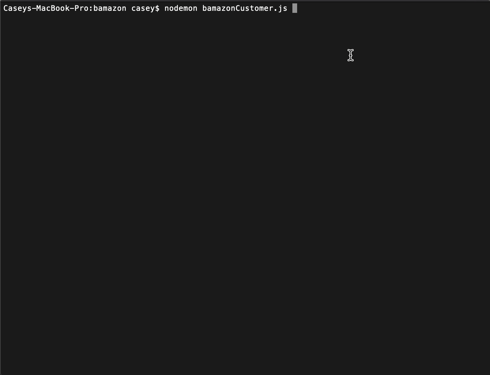

# BAMazon
---
- **For:** University of Denver Women's Coding Bootcamp
- **Developer:** Casey Eickhoff
- **Built With** Node.js, Javascript, MySQL

### Description
---
BAMazon is an Amazon-like storefront with MySql database. The app takes in orders from customers and deplete stock from the store's invetory. If there is enough inventory the customer will receive a purchase total. Otherwise, the customer is informed the item is out of stock.

### Functionality
--- 

    

